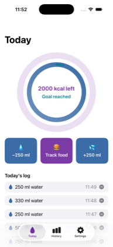
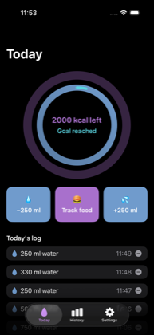

# HydroHomie

A SwiftUI hydration tracker for iOS 17+, with Apple Health sync and an interactive
home screen widget.

[](LICENSE)

<p>
  
  
</p>

## Features

- Two rings counting down to your daily goals — calories outside, water inside
- Add or remove water in one tap; press and hold the add button for an exact amount
- A configurable quick-add amount, so the buttons match the glass you actually use
- One log for the day, water and food together
- History with a 7- or 30-day chart, daily average and goal-met count
- Millilitres or US fluid ounces, switchable at any time without touching stored data
- Configurable reminders through the day
- Optional Apple Health sync, written as dietary water — and retracted when you undo
- Home screen widget with one-tap logging that never launches the app
- Light, dark or system appearance

## Requirements

- Xcode 26+ (iOS 26.5 SDK), iOS 17.0 deployment target
- No third-party dependencies

## Getting started

```bash
open HydroHomie.xcodeproj
```

Select the `HydroHomie` scheme and run. Building for the simulator needs no signing;
running on a device requires setting `DEVELOPMENT_TEAM` and registering the
`group.com.hydrohomie.app` App Group and HealthKit capability on your Apple
Developer account.

## Targets

| Target | Purpose |
|---|---|
| `HydroHomie` | The app — Today, History and Settings tabs |
| `HydroHomieWidget` | Home screen widget (small + medium) with one-tap logging |
| `HydroHomieTests` | Unit tests for unit conversion and daily aggregation |

## Layout

```
Shared/              compiled into both the app and the widget
  Models/            DrinkEntry, UserSettings, VolumeUnit
  Persistence/       SharedModelContainer, HydrationStore
  Intents/           AddDrinkIntent — backs the widget's quick-add buttons
  Assets.xcassets
HydroHomie/
  Views/             RootView, TodayView, HistoryView, SettingsView, ProgressRing, …
  Services/          HydrationLogger, HealthKitService, NotificationScheduler
HydroHomieWidget/  widget bundle, timeline provider and widget views
Config/              Info.plists and entitlements for both bundles
```

## Design notes

**Everything is stored in millilitres.** `VolumeUnit` converts only at the display
layer, so switching between ml and fl oz never mutates stored data or accumulates
rounding drift.

**One SwiftData store, shared through an App Group.** `SharedModelContainer` points
the store at the `group.com.hydrohomie.app` container so the widget reads the same
data the app writes. It falls back to the target's own Application Support directory
when the entitlement isn't granted, so an unsigned build still runs.

**`HydrationLogger` is the single funnel** for adding and deleting drinks — haptics,
HealthKit mirroring and widget refresh all happen there, so behaviour is identical no
matter which screen originated the change.

**Colour lives in the asset catalog, not in code.** `AccentColor` (#7B3BA5), `GoalColor`
and `RingTrack` each define a light and a dark variant, and `Shared/Theme.swift`
exposes the latter two as `Color.goal` / `Color.ringTrack`. The catalog is compiled
into both the app and the widget, so a colour change lands in both at once. The
dark accent is a lightened #A870CC — the base purple is too dark to read against a
black ground.

**Appearance is a stored preference.** Settings offers System / Light / Dark, applied
with `.preferredColorScheme`. Note this governs the app only: widgets always follow
the system appearance, so a phone in light mode shows a light widget even when the
app is pinned to dark.

**The rings fill up but the numbers count down.** Both arcs grow as you consume, which
keeps them legible as a pair, while the labels read "550 kcal left" / "500 ml left".
A literally draining calorie ring would have been full at breakfast — visually identical
to the water ring's goal-reached state, meaning the opposite thing.

**Exceeding the two goals means opposite things**, so the overflow arcs are tinted
separately: water past its goal is a win (`GoalColor`), calories past theirs is not
(`OverColor`).

**Settings fields only write back when actually edited.** A field holds its own rounded
display value, so committing an untouched one re-derives the stored amount from a
1-decimal string — 2000 ml becomes 1999 after a single trip through fl oz. The guard in
`commitGoal()` and friends exists for that reason; do not remove it.

**The widget writes directly to the store.** `AddDrinkIntent` runs in the widget's own
process, inserts the entry and reloads the timeline, so logging from the home screen
never launches the app.

## Tests

```bash
xcodebuild -project HydroHomie.xcodeproj -scheme HydroHomie \
  -destination 'platform=iOS Simulator,name=iPhone 17' test
```

## Not yet implemented

- Food logging — the 🍔 button is deliberately inert until the entry design is settled,
  so the calorie ring stays empty and calories-remaining stays at your full goal
- History charts water only, and the widget is water-only too
- The Settings appearance picker does not affect the widget (see above)
- Reminder scheduling is wired up but the permission flow hasn't been exercised end to end
- No app icon artwork — `AppIcon.appiconset` is an empty 1024×1024 slot
- HealthKit is write-only; nothing reads back water logged by other apps

## Contributing

Issues and pull requests are welcome — see [CONTRIBUTING.md](CONTRIBUTING.md). Note
that contributions carry a licence grant, for the reason explained there.

## Licence

HydroHomie is free software, licensed under the
[GNU General Public License v3.0 or later](LICENSE).

You may use, study, share and modify it. If you distribute it or a derivative, you
must pass on the same freedoms and publish your complete corresponding source under
the GPL.

A **commercial licence** is available for anyone who wants to build on HydroHomie
without those obligations — including shipping a proprietary derivative on the App
Store, whose terms conflict with the GPL. See
[COMMERCIAL-LICENSING.md](COMMERCIAL-LICENSING.md).

Copyright (C) 2026 mefiblogger.
